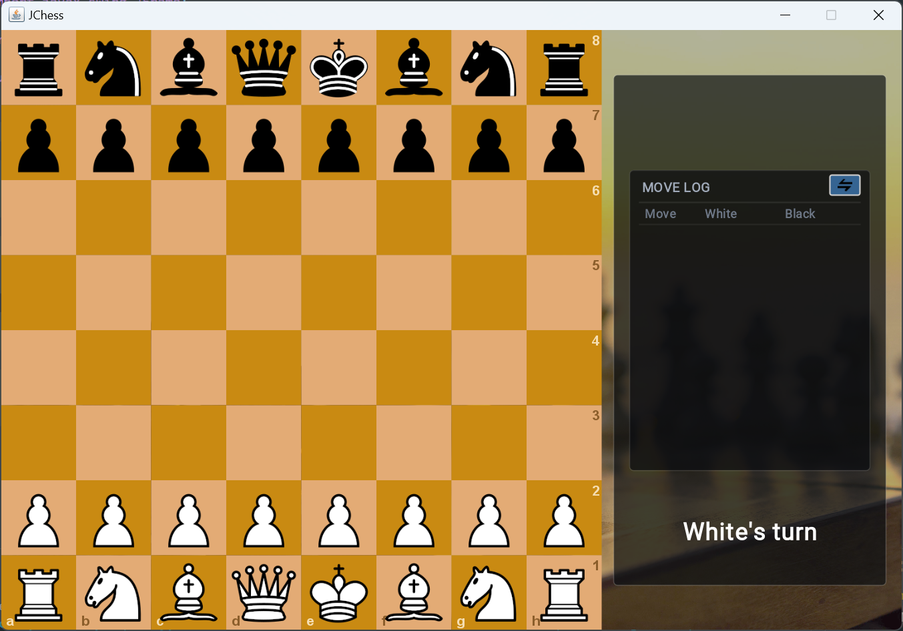

# 🧩 JChess

A classical chess game implemented in **Java** with a Swing-based graphical interface.  
The game enforces all official chess rules — including **castling**, **en passant**, **pawn promotion**, and **checkmate/stalemate detection** — with a move history log, per-player timers, and board navigation.



---

## 🎮 Features

### Core Gameplay
- **Full chess rule enforcement** — legal move validation, check/checkmate/stalemate detection, castling, en passant, pawn promotion
- **Drag-and-drop piece movement** with visual feedback (move dots, capture rings, hover effects)
- **Real-time legal move highlighting** — shows all valid squares for the selected piece
- **Move log** — scrollable list of all moves in Standard Algebraic Notation (SAN)
- **Per-player countdown timers** — configurable initial time, auto-pauses when window loses focus
- **Board flip** — toggle perspective to play as Black from the bottom
- **Undo** — revert the last move
- **Resignation** — each player can resign at any time
- **Insufficient material detection** — automatic stalemate when neither side has enough pieces to checkmate
- **FEN export** — copy the current board state as a FEN string via the FEN button or the `F` key

### Visual & Interaction
- **Animated piece movement** — pieces slide smoothly to their destination squares
- **Checked king glow** — red pulsing highlight around the king when in check
- **Last move highlight** — yellow-green overlay on the from/to squares of the most recent move
- **Right-click annotations** — draw highlight circles and arrows on the board for analysis
- **Game-over overlay** — displays result (checkmate, stalemate, resignation, timeout) with "Play again" and "Main Menu" buttons
- **Title screen** — initial menu to start a new game

### Navigation & History
- **Move navigation** — browse through the game history with `←`/`→`/`↑`/`↓` keys or on-screen navigation buttons (`|<` `<` `>` `>|`)
- **Live/history toggle** — navigate back to review past moves, then return to the live position

### Keyboard Shortcuts
| Key | Action |
|-----|--------|
| `←` | Previous move |
| `→` | Next move |
| `↑` | Go to start position |
| `↓` | Go to end (live) position |
| `F` | Flip board |
| `Ctrl+Z` | Undo last move |

---

## 🧱 Architecture

```
src/com/jchess/
├── Main.java                          # Entry point — sets up JFrame with layered title/game panels
├── game/
│   ├── GameManager.java               # Core game state, piece management, turn logic, FEN export
│   ├── MoveValidator.java             # Legal move validation, check/checkmate detection, castling
│   └── GameHistoryManager.java        # Undo history, move navigation snapshots
├── model/
│   ├── Board.java                     # Board rendering (checkered squares, coordinates)
│   ├── BoardState.java                # Serializable board state for history snapshots
│   ├── Piece.java                     # Base piece class with position, movement, and rendering
│   └── piece/
│       ├── PieceType.java             # Enum: PAWN, KNIGHT, BISHOP, ROOK, QUEEN, KING
│       ├── Pawn.java                  # Pawn movement logic (double push, en passant, promotion)
│       ├── Knight.java                # Knight movement logic
│       ├── Bishop.java                # Bishop movement logic
│       ├── Rook.java                  # Rook movement logic
│       ├── Queen.java                 # Queen movement logic
│       └── King.java                  # King movement logic (castling)
├── view/
│   ├── GamePanel.java                 # Main game rendering, input handling, timer, UI controls
│   ├── GamePanelMoveLogRenderer.java  # Move log rendering in the side panel
│   ├── TitlePanel.java                # Title/menu screen
│   ├── animation/
│   │   └── PieceAnimation.java        # Smooth piece movement animation
│   └── render/                        # Additional rendering utilities
├── input/
│   └── Mouse.java                     # Mouse input handler (position, button states)
├── audio/
│   └── SoundManager.java              # Sound effects for moves and captures
├── util/
│   └── MoveRecord.java                # Data class for recording each move
└── resources/
    ├── background.jpg                 # Game background image
    ├── background - 3.jpg             # Alternative background
    ├── title_background.jpg           # Title screen background
    ├── icons/                         # UI icons (flip, resign, undo)
    ├── pieces/                        # Piece sprite images
    └── sounds/                        # Sound effect files
```

### Key Design Decisions

- **`pieces` vs `simPieces`** — `pieces` holds the committed board state; `simPieces` is a working copy used during drag simulation to test legal moves without affecting the real board
- **Coordinate system** — internal rows 0–7 map to chess ranks 1–8 (row 0 = rank 1, white's home rank; row 7 = rank 8, black's home rank)
- **FEN generation** — the `getFEN()` method builds a standard FEN string from the current `pieces` list, including piece placement, active color, castling rights, en passant target, halfmove clock, and fullmove number

---

## 🚀 Getting Started

### Prerequisites
- Java Development Kit (JDK) 8 or later

### Compile & Run
```bash
# Compile all source files
javac -d bin -sourcepath src src/com/jchess/Main.java

# Run the game
java -cp bin com.jchess.Main
```

### Build & Run (single command)
```bash
javac -d bin -sourcepath src src/com/jchess/Main.java && java -cp bin com.jchess.Main
```

---

## 📄 FEN Format

The `getFEN()` method in `GameManager` exports the board state in standard [Forsyth–Edwards Notation](https://en.wikipedia.org/wiki/Forsyth%E2%80%93Edwards_Notation):

## 🖱️ Controls

| Action | Input |
|--------|-------|
| Select / move piece | Left-click and drag |
| Highlight square | Right-click on a square |
| Draw arrow | Right-click and drag from one square to another |
| Clear annotations | Left-click on the board |
| Flip board | Click the flip icon or press `F` |
| Undo | Click the undo icon or press `Ctrl+Z` |
| Resign | Click the resign icon |
| Copy FEN | Click the FEN button |
| Navigate moves | Use `←` `→` `↑` `↓` keys or on-screen nav buttons |
| Scroll move log | Mouse wheel over the move log area |