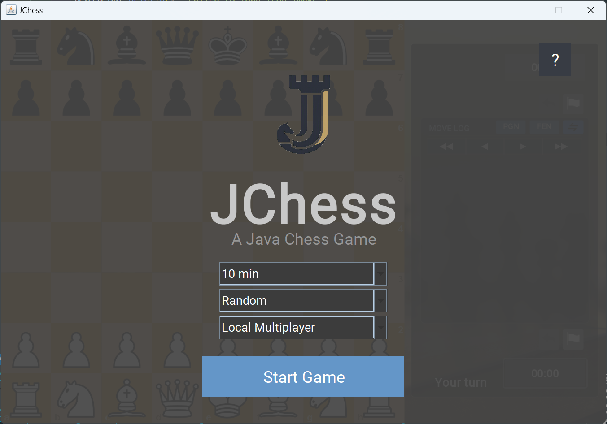
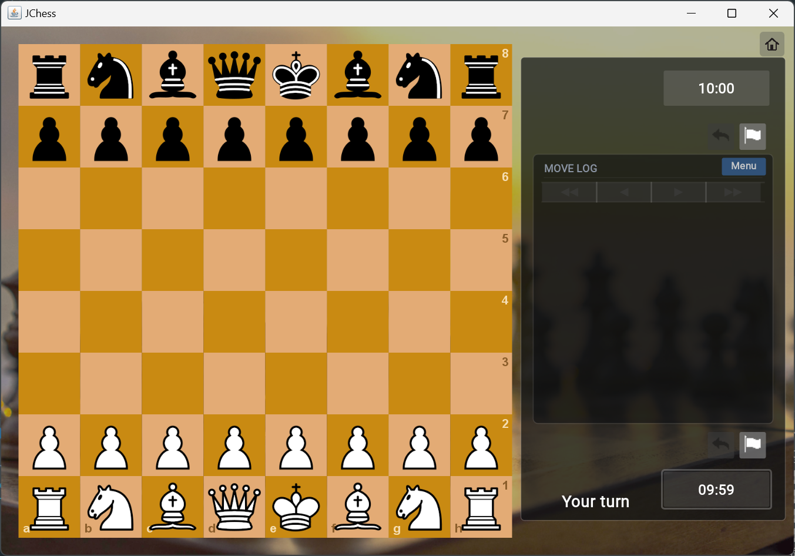
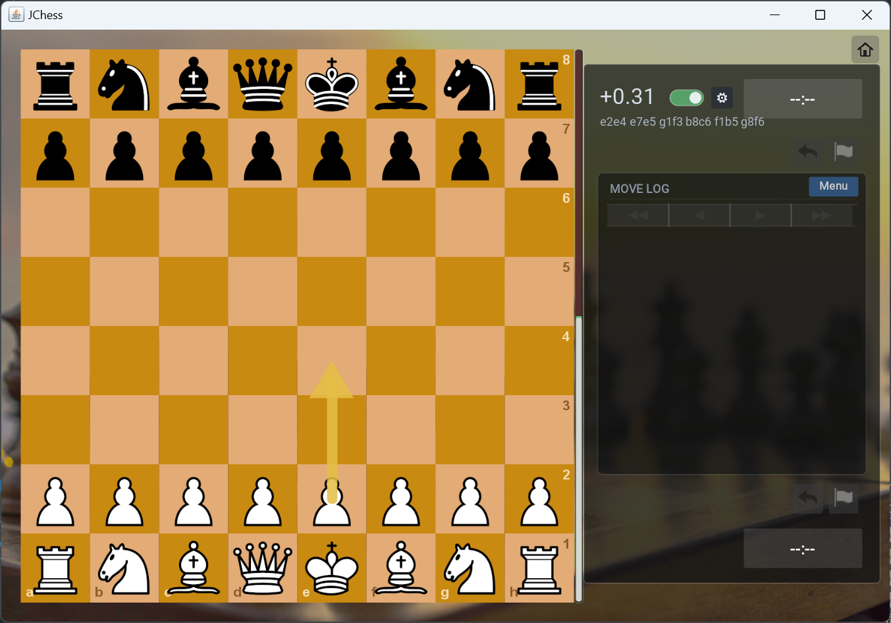

# 🧩 JChess

A classical chess game implemented in **Java** with a Swing-based graphical interface.  
The game enforces all official chess rules — including **castling**, **en passant**, **pawn promotion**, and **checkmate/stalemate detection** — with a move history log, per-player timers, and board navigation.





---

## 🎮 Game Modes

### Local Multiplayer
Play with a friend locally on the same board. Choose a time control (1–60 min) and side (White, Black, or Random).

### vs Computer (Stockfish)
Play against the Stockfish engine with selectable difficulty:
- **Easy** — 300ms per move
- **Medium** — 600ms per move
- **Hard** — 1000ms per move
- **Master** — 1500ms per move

### Analysis Mode
Explore positions with real-time Stockfish engine evaluation:
- **Evaluation bar & numeric score** — dynamic white/black advantage display
- **Principal variation (PV)** — shows the engine's best line; click any move to play it
- **Best move arrow** — gold arrow overlay showing the engine's recommended move
- **Engine toggle** — enable/disable the engine at any time
- **Analysis settings** — configure search time (2–60s), multiple lines (1–4), threads (1–4), and memory (16–512 MB)
- **Move quality** — blunders (≥300cp loss) are highlighted in red in the move log
- **Space key** — play the engine's best move instantly
- No timer, and the game never ends

---

## 🎨 Features

### Core Gameplay
- **Full chess rule enforcement** — legal move validation, check/checkmate/stalemate detection, castling, en passant, pawn promotion
- **Drag-and-drop piece movement** with visual feedback (move dots, capture rings, hover effects)
- **Real-time legal move highlighting** — shows all valid squares for the selected piece
- **Move log** — scrollable list of all moves in Standard Algebraic Notation (SAN) with Unicode piece symbols and per-move time spent
- **Per-player countdown timers** — configurable initial time, auto-pauses when window loses focus
- **Board flip** — toggle perspective to play as Black from the bottom
- **Undo** — revert the last move
- **Resignation** — each player can resign at any time
- **Insufficient material detection** — automatic stalemate when neither side has enough pieces to checkmate
- **Captured pieces tracker** — shows captured pieces and material advantage for each side

### Visual & Interaction
- **Animated piece movement** — pieces slide smoothly to their destination squares
- **Checked king glow** — red pulsing highlight around the king when in check
- **Last move highlight** — yellow-green overlay on the from/to squares of the most recent move
- **Right-click annotations** — draw highlight circles and arrows on the board for analysis
- **Game-over overlay** — displays result (checkmate, stalemate, resignation, timeout) with "Play again" and "Main Menu" buttons
- **Title screen** — initial menu with time control, side, mode, and difficulty selectors

### Export & Menu
- **PGN export** — copy the full game in Portable Game Notation via the Menu → Show PGN
- **FEN export** — copy the current board state as a FEN string via the Menu → Show FEN
- **In-game menu** — Flip Board, Settings, Show PGN, Show FEN
- **Home button** — return to the title screen at any time

### Settings
- **Board style** — Classic, Slate, Midnight
- **Piece style** — Alpha, Neo, Wood
- **Sound volume** — adjustable slider

### Navigation & History
- **Move navigation** — browse through the game history with `←`/`→`/`↑`/`↓` keys or on-screen navigation buttons (`|<` `<` `>` `>|`)
- **Live/history toggle** — navigate back to review past moves, then return to the live position
- **Clickable move log** — click any move in the log to jump to that position

### Keyboard Shortcuts
| Key | Action |
|-----|--------|
| `←` | Previous move |
| `→` | Next move |
| `↑` | Go to start position |
| `↓` | Go to end (live) position |
| `F` | Flip board |
| `Ctrl+Z` | Undo last move |
| `Space` | Play best move (Analysis Mode) |

---

## 🚀 Getting Started

### Prerequisites
- Java Development Kit (JDK) 8 or later

### Compile & Run
```bash
javac -d bin -sourcepath src src/com/jchess/Main.java && java -cp bin com.jchess.Main
```

### Stockfish Configuration
By default, JChess looks for the Stockfish engine in the following order:
1. User-configured path saved in `stockfish_path.txt`
2. `stockfish/stockfish-windows-x86-64-avx2.exe` (included with the project)
3. `stockfish.exe` (system PATH)

If the engine cannot be found, a file chooser will prompt you to locate the Stockfish binary.

---

## 🖱️ Controls

| Action | Input |
|--------|-------|
| Select / move piece | Left-click and drag |
| Highlight square | Right-click on a square |
| Draw arrow | Right-click and drag from one square to another |
| Clear annotations | Left-click on the board |
| Flip board | Click the flip icon or press `F` |
| Undo | Click the undo icon or press `Ctrl+Z` |
| Resign | Click the resign icon |
| Copy PGN / FEN | Menu → Show PGN / Show FEN |
| Navigate moves | Use `←` `→` `↑` `↓` keys or on-screen nav buttons |
| Scroll move log | Mouse wheel over the move log area |